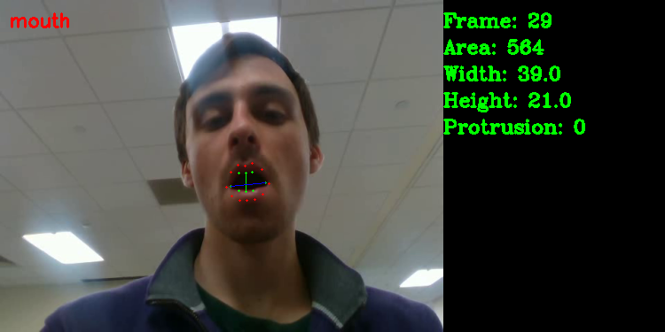
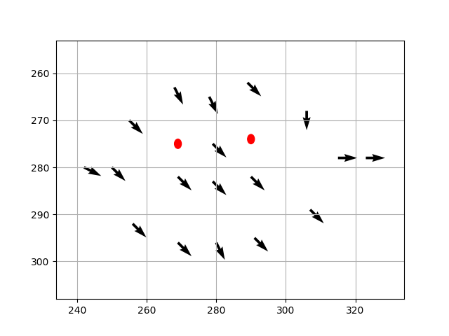
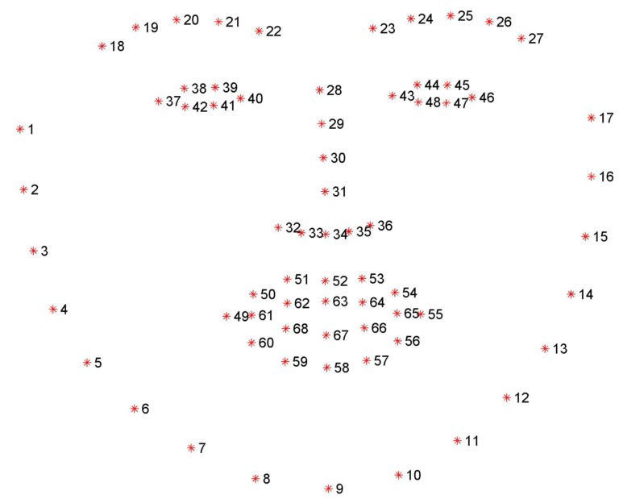

# Project 12 - Vocal Volume Viewer

## Summary

When looking to study the production of speech in the human vocal tract it is important to understand what is physically happening inside of it. This is difficult to achieve because of the closed nature of the system. The part we are interested in studying is the volume of the pharynx, which is part of the throat. However, after previous work and experiments, it has been decided that current technology does not allow for this area to be easily viewed and documented.  Thus, our focus is being shifted to the end of the vocal tract: the lips. Being able to track lip characteristics during speech will still offer valuable insight into the production of speech.

This project will be focused on the creation of a device used to measure and track the lips during speech. There are currently no commercially available devices specifically designed to accomplish these goals, and such this is currently completed by hand. The final solution should be able to measure an aspect of the lips physical size and provide these measurements in real-time.

## Directory Overview

<b> .vscode </b> - Visual Studio code useful for debugging and making the coding process easier.

<b> Archive </b> - A directory used for old, outdated files that were used during the initial development phase of our project.

<b> GUI Code </b> - Python scripts used to generated the GUI and provide a means to process the data. The bulk of our repository.

<b> Assets </b> - A simple directory holding .png files used for the GUI's overlay. These picture files are used to align the camera with the subject's lips.

<b> Checkerboards </b> - An older repository created in case we needed to produce a 3D model of the vocal tract. Not currently in use but could be useful for further iterations of this project.

## GUI and Data Processing Analysis

The following section aims to provide detailed information on the GUI and data processing scripts, which act as the bulk of our project.

### GUI.py

The GUI python file creates the GUI for our project and acts as the project's central hub. Here, the user can align the camera to the appropriate position, start and stop recording, save video files in a .avi format, and start the data processing scripts.
The GUI was built using the tkinter library and, when run, calls the User Interface library. The User Interface library then populates the GUI with 
widgets, buttons, and a display, essentially making the GUI functional.

### UserInterface.py

UserInterface.py is a class that instantiates tangible functions on the GUI. Essentially, the GUI.py file calls this class and the UserInterface class populates the GUI.
The UserInterface class initially sets the source camera, the camera used to capture the data, to 0 which can either be a camera inserted into the computer via a USB port or the User's webcam. This depends on if the User's machine has a functional webcam.
If no camera is found, the user is presented with an error and must restart the program. Then, the window is defined and the menu system is created. The menu system allows for the user to start a new video, save a video, exit, and read documentation of the opencv library.
The last part of the UserInterface class's instantiation is creating buttons used to stop and start recording.
Most importantly, the UserInterface class creates the canvas which shows a live feed from the camera. This live feed is retrieved from the Video Capture class in VideoCapture.py

Notable functions of this class include: begin_capture(), stop_capture(), update(), toggle_overaly(), update_settings(), and close_settings_window().

<b> begin_capture() </b> - Calls the video writer and begins video capture. Called via a button press.

<b> stop_capture() </b> - Stops capture and closes the video writer. Called via a button press.

<b> update() </b> - Essentially determined by the FPS of the camera, the canvas showing the live video feed is updated with a new frame. This maintains the live feed on the GUI.

<b> toggle_overlay() </b> - Toggles the video overlay. A .png file is retrieved from the Assets folder and is placed in the center of the video feed. Once the Toggle Overlay button is clicked, this image is either removed or placed depending on its current state.

<b> update_settings() </b> - Opens a new, small window that will allow the user to change the settings of the camera. This is still a work in progress. Triggered via a button press on the main GUI.

<b> close_settings_window() </b> - Closes the settings window. Triggered via a button click on the settings window.

Future work on the menu system includes, manipulating camera settings such as resolution and FPS as well as running the data processing scripts from the GUI itself.

### VideoCapture.py

VideoCapture.py is responsible for creating the video capture process. During its initialization, the Video Capture class sets the FPS to be 30 and the resolution to be 640x480. This was hard-coded into our scripts in order to accomodate our camera. These could be changed in the future. Then, the configurations required for retrieving the depth data from each frame. The documentation that we refered to for this was through the Intel RealSense library. This initialization is called once the User Interface is created. This class has several key functions that are critical to our project.

<b> get_frame() </b> - This function, once called from the UI, waits for the camera to capture a frame. Our camera captured both RGB and Depth data, so we made sure to accomodate both feeds. Once these frames are received, they are translated to be viewable in the GUI and are returned. If video capture has begun, each frame is saved to a video file until capture concludes.

<b> new _writer() </b> - Creates the writer that starts video capture. Called when the "Start Capture" button on the GUI is pressed.

<b> close_writer() </b> - Closes the writer necessary for video capture. Called when the "Stop Capture" button on the GUI is pressed. Only saves RGB data, depth data will need to be implemented at a later date. 

<b> save() </b> - Creates a file dialog that will allow the user to name the file and choose where it is saved. 

<b> write_depth_data() </b> - Saves the data capture from the depth camera to the working directory. 

<b> Destructor </b> - Shuts the camer down. Necessary for a smooth exit when the user closes the GUI.

### LipAnalysis.py 

LipAnalysis.py is the script that recognizes facial features of the subject and relays the necessary information (including mouth, height, width, and area) back to the user. This process is currently a standalone process but could easily be incorporated with the User Interface and Video capture classes. When ran, the script first defines its "predictor" and "detector". These components are defined by the library dlib, which utilizes a model to predict facial landmarks of an image. After this, the script creates an filepath where all of the data will be saved. A video, presumably created by the VideoCapture class is opened and then the frame-by-frame analysis is begun. 

The analysis starts with retrieving each frame from the video. If a frame is missing, then the main data processing loop is skipped. Otherwise, the frame is passed into the algorithm. First, the frame detects where possible facial landmarks are on the subject's face and then the predictor determines pixel-specific locations of each landmark. These locations are then passed into a function called "face_utils.shape_to_np()", which converts the set of coordinates into a numpy array. Through this array, the dlib library, and the shape_predictor_68_face_landmarks.dat file, we can identify which pixels belong to the subject's mouth region. For each pixel location belonging to the mouth region, the code iterates through each pixel, places a dot on the frame and gathers relevant data using 4 key functions. After this, the data is outputted to the frame and the process continues until every frame is analyzed. The key functions and components ofthe loop are as follows:

<b> get_area() </b> - Returns the area of the mouth. This is determined by finding the total number of pixels within the inner-most ring of pixels. The pixel range is determined by the dlib library and is constant. 

<b> get_height() </b> - Returns the height of the mouth. Returns the pixel distance between the highest inner lip pixel with the lowest inner lip pixel.

<b> get_width() </b> - returns the width of the mouth. Returns the pixel distance between the left-most inner lip pixel with the right-most inner lip pixe.

<b> Optical Flow Analysis </b> - Not an explicit function of LipAnalysis.py, but for each iteration of the loop after the first frame, each pixel location is compared with its respective location in the previous frame. This data is outputted in a vetor map indicating which direction each pixel has moved. If the pixel has not moved, then a red circle is placed in its respective location. 

LipAnalysis.py has three critical outputs. The first being each relevant piece of data (height, area, width, protrustion, and frame number) is recorded to a CSV file in the working directory. Along with this information, each .png file of the frame and its relevant information is saved to the working directory along with the CSV file. An example of this is below:

Lastly, the Optical flow analysis provides its output for each from in a .png file. An example of this is below.

### shape_predictor_68_face_landmarks.dat

Lastly, a critical component of our lip recognition scripts comes from the shape_predictor_68_face_landmarks.dat file. Using a pre-trained neural network model, dlib utilizes this file in order to plot 68 points (x,y) on a person's face. The ordering of these pixels does not change. These 68 points are separated into regions as well, these regions are encoded into the "FACIAL_LANDMARKS_IDXS" dictionary referenced in LipAnalysis.py. These regions and there range of points are as follows:

Jaw - (0, 17)

Right Eyebrow - (17, 22)

Left Eyebrow - (22, 27)

Nose - (27, 35)

Right Eye - (36, 42)

Left Eye - (42, 48)

<b> Mouth - (48, 68) </b>

Here, we are able to isolate pixels regions that we need. Other regions could be utilized in further iterations of this project. There are a few drawbacks with this library however. We noticed that the model suffered for videos that had poor lighting, obstructed faces, and jerky movements. This will need to be taken into account for the future. 
